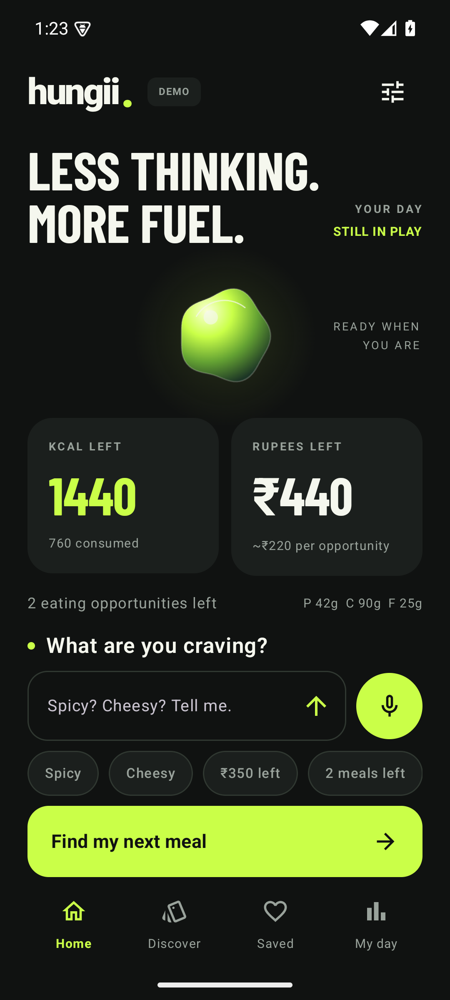
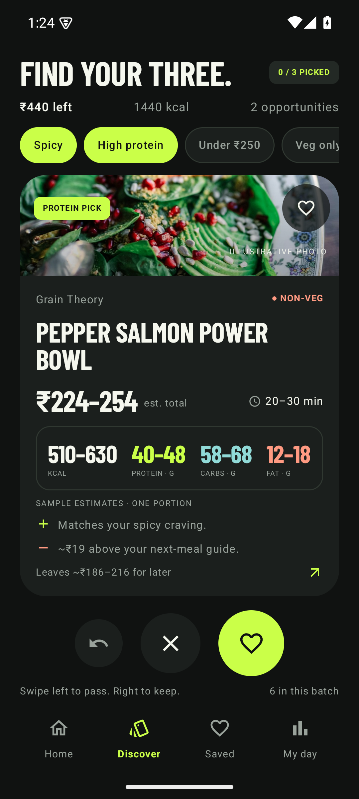
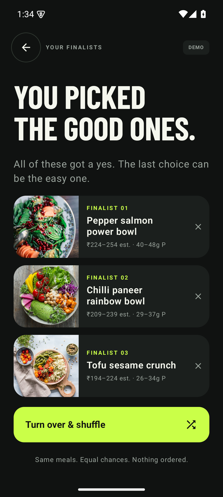
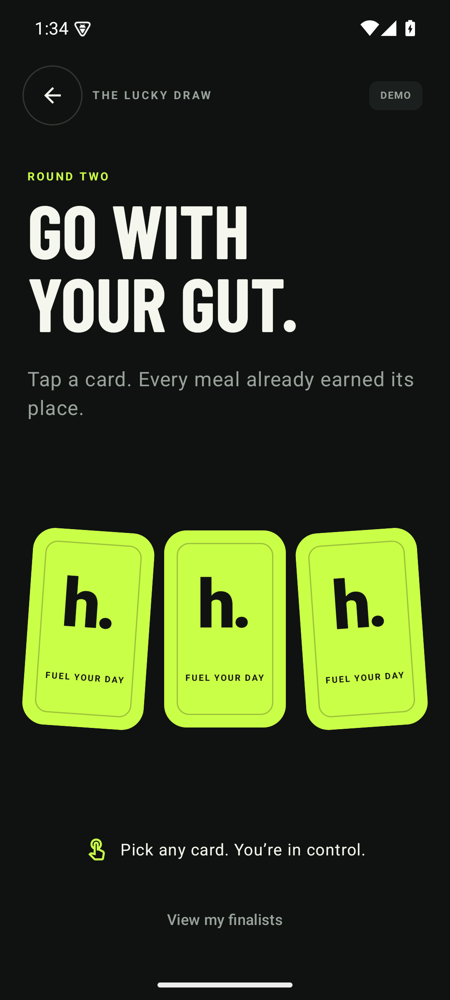
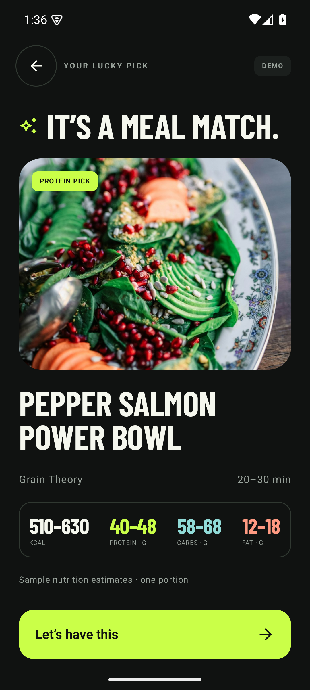
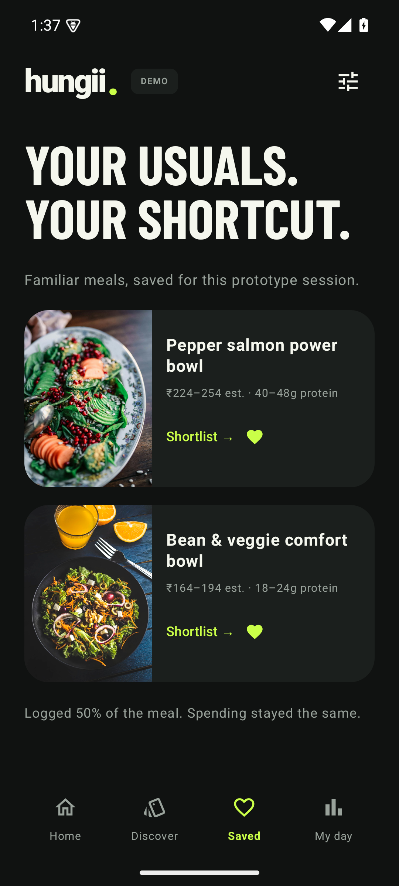

# Hungii Android prototype review

Native Kotlin / Jetpack Compose prototype with the selected charcoal and electric-lime direction. The design explores check-in → swipe to keep three meals → face-down shuffle → pick and reveal → review the bill → log consumption. Usability verdict is pending user review.

## Build and checks

`assembleDebug` and `lintDebug` passed. The review APK passed Android signature verification.

Manual checks used a dedicated Android 15 Pixel 7 emulator at 411 dp and 360 dp widths:

| Behaviour | Observed result |
| --- | --- |
| Typed check-in | Updating money left changed the tracker; undo restored it. Craving changes reordered sample meals. |
| Meal selection | Swipe and buttons supported keeping, passing and undoing. Three distinct finalists reached the draw. |
| Lucky draw | Cards hid their meals, shuffled, and accepted a pick after the animation. An early tap did not select a meal. |
| Review and confirmation | Selecting a card did not spend money or log intake. Confirmation recorded the sample bill and reserved nutrition. |
| Coupon example | A ₹40 side reduced the flatbread's final demo bill from ₹264 to ₹244 and increased its nutrition ranges. |
| Portion logging | Logging half the salmon meal increased consumed nutrition and left 255–315 kcal reserved. Spending stayed ₹394, with ₹206 left. |
| Next decision | Confirmation cleared the previous shortlist; discovery started at 0/3 with the updated allowance and meal opportunities. |
| Saved meals | Saved meals displayed shortcuts and removal controls. |
| Compact layout | Main actions, meal stats and review totals remained visible on the 360 dp phone layout. |

The latest leftover entry and its “I ate the rest” action were inspected visually. Completing that final action could not be rechecked after the emulator became unavailable. Actual microphone recognition and system reduced-motion behaviour were not exercised.

The T3 Device panel reported an unavailable Android host, so verification used ADB against the dedicated emulator. The emulator host crashed during earlier runs; its exact cause remains unresolved. No connected physical phone was changed.

## Screenshots

| Check-in | Meal card |
| --- | --- |
|  |  |

| Three finalists | Lucky draw |
| --- | --- |
|  |  |

| Reveal | Saved meals |
| --- | --- |
|  |  |

[Daily tracker](android-day.png) · [Reserved leftovers](android-leftovers.png) · [Coupon experiment](android-coupon.png)

## Limits

Meals, restaurants, nutrition, delivery times and offers are fictional fixtures. Nutrition estimates describe the fixtures, not the illustrative photos. There is no Swiggy connection, real checkout, account, persistence or AI conversation. Check-in uses a small local phrase parser. Price ranges can cross the remaining allowance; the demo confirmation checks its calculated total again. State resets when the activity is recreated or the app restarts.

The APK is a debug review artifact, not a production release. SHA-256: `39c9a020b4bb650267a5890fdba464f7efafd0659241314b521b03b77e137bdd`.
