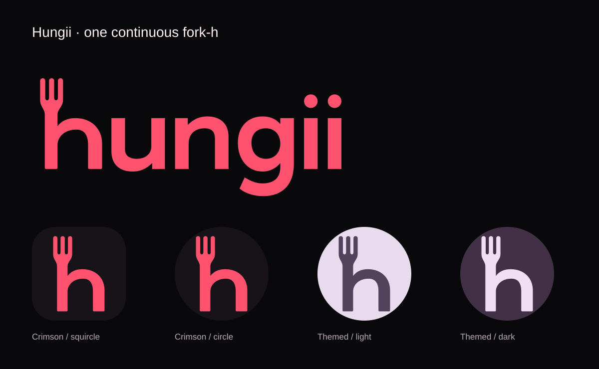

# Fork-h brand verification — 6 October 2026

Version 0.8.1, Android code 16. The supplied reference becomes one continuous, flat fork-h silhouette and matching original outlined lowercase wordmark. Editable geometry generates SVGs, Android vectors and broker HTML branding. Historical screenshots/releases stay unchanged.

## Appearance

- Emulator install/update of both variants succeeded. Real app Home uses the wordmark with clear spacing and an accessible Hungii image description. Launcher app drawer shows the new circular crimson icon for both flavors without clipping.
- The prototype header loads the shared SVG at 124 × 55px with alt text. Browser screenshot capture failed; DOM image loading and rendered dimensions were verified instead.
- Android 26+ uses separate adaptive foreground/background layers. Android 33+ supplies a single-fill monochrome layer. The packaged APK resource was inspected with aapt2 and contains `monochrome`. The emulator’s Wallpaper & style → Home screen → Themed icons toggle was enabled, and the installed Simulator’s shared fork-h changed to the wallpaper-derived blue palette on the home dock. Both flavors package the same icon resources. Representative light/dark tints are shown above.
- Mumbai Edge API version 13 deployed; the welcome page returns HTTP 200 in ap-south-1 with a short readable Hungii return message. The shared Supabase domain rewrites HTML as plain text, so it must not expose SVG markup. Source HTML retains the shared wordmark for a future rendering-capable custom domain; no custom domain was provisioned. [Supabase routing restriction](https://supabase.com/docs/guides/functions/http-methods). Provider ordering gates remain unchanged and disabled.

[Before Home](fork-h-before.png) · [Updated Home](fork-h-home.png) · [Launcher](fork-h-launcher.png) · [Actual themed launcher](fork-h-themed-launcher.png)

## Checks

Final Android build completed successfully in 2m 14s: both variants assemble, 24 existing unit tests and both lint tasks pass. Deno type checking passes; 42 backend/Simulator tests, including the readable broker return page, and seven Assistant tests pass. Generated-asset consistency, Android XML parsing, repository hygiene and whitespace checks pass.

The launcher chooses the mask and, when enabled/supported, wallpaper colors. Hungii does not offer a separate in-app control for the operating system launcher theme. App colors stay crimson. See [brand source and update instructions](../assets/brand/README.md).
