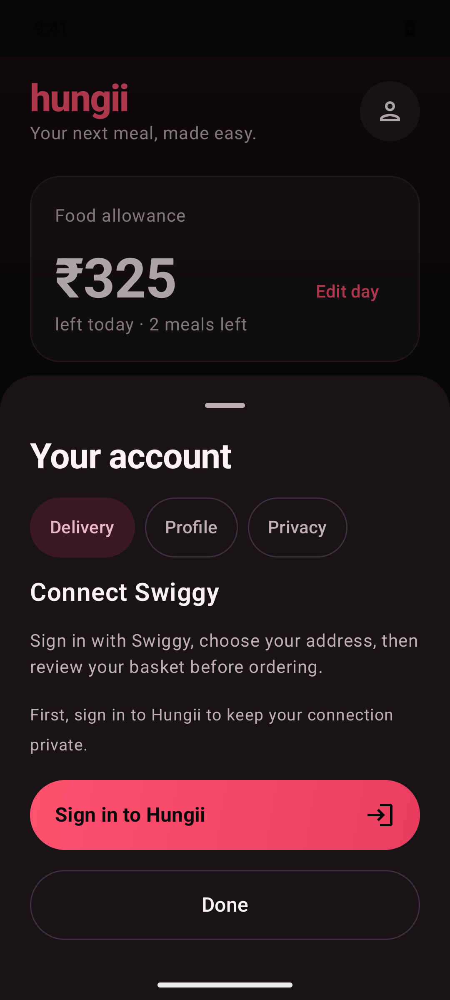

# Checkout preparation verification — 4 October 2026

Version 0.8.0 (Android code 15) prepares the Food checkout flow. Live ordering remains disabled; no real payment or order was placed.

## Execution evidence

- Deno: 41 tests passed, including changed totals, ownership, ambiguous placement recovery, duplicate request protection, payment confirmation and provider errors. Both API and Simulator type checks passed.
- Android: both variants built, 24 unit tests passed, both lint tasks passed. Final build completed successfully in 1m 41s.
- Python Assistant: seven regressions passed; repository hygiene and whitespace checks passed.
- Database: the new migration and checkout-recovery SQL assertions passed twice in reviewed rollback transactions against the existing Mumbai project. Duplicate requests, overlapping pending attempts, owner separation, anonymous access and deletion tombstones were checked.
- Deployment: migration `202610040001` installed and recorded, RLS enabled. Edge API `hungii-api` version 11 is active. Deployed welcome returned HTTP 200 with `x-sb-edge-region: ap-south-1`; unsigned status returned HTTP 401 / `HUNGII_LOGIN_REQUIRED`.
- Server gates explicitly set false: ordering, cart contract verification, session resume verification and production approval. WorkOS token verification remains inside the handler (`verify_jwt=false` is required for that identity provider).
- Emulator: real app opens, home exposes delivery settings, simplified sheet has one sign-in action. Synthetic developer flow exercised basket, UPI review, pending status, retry after explicit failure, successful order and tracking.

## Limits

Synthetic checkout evidence does not verify Swiggy staging or production. Approved credentials, cart member/price contracts, session resume and payment bridge behavior still require staging verification. Customized variants/add-ons are refused until their contract is verified. Unknown order outcomes block replacement checkout; automated provider reconciliation is not implemented. The developer application is prepared but has not been submitted.

One public user APK is published; Simulator remains an internal testing variant. Prior release assets are preserved.
